# ZEN-MIND Complete Class Diagrams & Specifications
## CSE Department, KLECET, Chikodi 2024-25

---

## TABLE OF CONTENTS
1. [User Authentication Module](#1-user-authentication-module)
2. [Mood Tracking Module](#2-mood-tracking-module)
3. [Journal Management Module](#3-journal-management-module)
4. [Therapist Booking Module](#4-therapist-booking-module)
5. [Appointment Management Module](#5-appointment-management-module)
6. [Payment Processing Module](#6-payment-processing-module)
7. [Chat Module (Botpress)](#7-chat-module-botpress)
8. [Resources Module](#8-resources-module)
9. [Email Notification Module](#9-email-notification-module)
10. [Database Service Module](#10-database-service-module)
11. [PlantUML Diagram Code](#11-plantuml-diagram-code)
12. [Mermaid Diagram Code](#12-mermaid-diagram-code)

---

## 1. USER AUTHENTICATION MODULE

### 1.1 User Class

**Attributes:**
- `_id`: ObjectId - Unique identifier for the user
- `name`: String - Full name of the user
- `email`: String - Email address (unique, validated, lowercase)
- `password`: String - Hashed password using bcrypt (hidden in responses)
- `age`: Number - User age (13-19 for teenagers)
- `gender`: String - Gender (male/female/non-binary/prefer-not-to-say)
- `avatar`: String - Profile picture URL
- `phone`: String - Phone number (optional)
- `createdAt`: Date - Account creation timestamp
- `updatedAt`: Date - Last update timestamp

**Methods:**
- `comparePassword(candidatePassword: String)`: Promise<Boolean> - Compares plain text password with hashed password for login verification
- `hashPassword()`: void - Automatically hashes password before saving (pre-save middleware hook)
- `updateProfile(profileData: Object)`: Promise<User> - Updates user profile (name, email, age, gender, phone, avatar) from Settings page
- `updatePassword(oldPassword: String, newPassword: String)`: Promise<User> - Changes password after validating old password

**Functionality:**
Manages user accounts with secure authentication. Handles user registration with email validation and password hashing using bcrypt. Stores profile information including name, email, age, gender, profile picture, and phone number. Provides methods for login authentication by comparing passwords, profile updates from Settings page, and password changes. Implements automatic password hashing before database save to ensure security.

---

### 1.2 AuthenticationService Class

**Attributes:**
- `JWT_SECRET`: String - Secret key for JWT token signing (environment variable)
- `JWT_EXPIRE`: String - Token expiration time (7 days)
- `SALT_ROUNDS`: Number - Bcrypt salt rounds for password hashing (10)
- `OTP_EXPIRY`: Number - OTP expiration time in minutes (5)

**Methods:**
- `register(name: String, email: String, password: String, age: Number)`: Promise<User> - Registers new user and sends welcome email
- `login(email: String, password: String)`: Promise<Object> - Authenticates user and returns JWT token
- `sendOTP(email: String)`: Promise<String> - Generates and sends OTP to email for password reset
- `verifyOTP(email: String, otp: String)`: Promise<Boolean> - Verifies OTP code entered by user
- `resetPassword(email: String, otp: String, newPassword: String)`: Promise<Boolean> - Resets password after OTP verification
- `generateToken(userId: ObjectId)`: String - Generates JWT token for authenticated sessions
- `verifyToken(token: String)`: Object - Verifies JWT token and returns user data
- `sendWelcomeEmail(email: String, name: String)`: Promise<void> - Sends welcome email via Brevo after registration

**Functionality:**
Provides complete authentication services for user registration, login, and password recovery. Implements registration flow with automatic welcome email sent via Brevo. Handles login by validating email/password and returning JWT token for session management. Supports forgot password functionality through OTP generation (6-digit code) sent to user's email with 5-minute expiration. Verifies OTP and allows password reset. Generates JWT tokens with 7-day expiration for maintaining authenticated sessions. Hashes passwords using bcrypt with 10 salt rounds for security.

---

### 1.3 OTP Class

**Attributes:**
- `_id`: ObjectId - Unique identifier for OTP record
- `email`: String - Email address associated with OTP
- `otp`: String - Generated 6-digit OTP code
- `expiresAt`: Date - OTP expiration timestamp (5 minutes from creation)
- `isUsed`: Boolean - Whether OTP has been used (prevents reuse)
- `createdAt`: Date - OTP creation timestamp

**Methods:**
- `generateOTP()`: String - Generates random 6-digit OTP code
- `verify(code: String)`: Boolean - Verifies OTP code and checks if expired
- `markAsUsed()`: Promise<OTP> - Marks OTP as used after successful password reset
- `isExpired()`: Boolean - Checks if OTP has expired (more than 5 minutes old)

**Functionality:**
Manages one-time password codes for forgot password functionality. Generates secure 6-digit random OTP codes when user requests password reset. Stores OTP with email association and 5-minute expiration timestamp. Verifies user-entered OTP codes and checks expiration status. Marks OTPs as used after successful verification to prevent reuse attacks. Automatically expires after 5 minutes for security.

---

## 2. MOOD TRACKING MODULE

### 2.1 Mood Class

**Attributes:**
- `_id`: ObjectId - Unique identifier for mood entry
- `userId`: ObjectId - Reference to User who logged mood
- `mood`: String - Mood type (happy/sad/anxious/stressed/calm/angry/excited)
- `intensity`: Number - Mood intensity on 1-10 scale (1=low, 10=high)
- `suggestion`: Object - AI-generated suggestion based on mood
- `suggestion.activity`: String - Suggested activity
- `suggestion.message`: String - Motivational message
- `suggestion.resources`: Array<String> - Recommended resources (videos/music)
- `date`: Date - Mood log date
- `createdAt`: Date - Entry creation timestamp

**Methods:**
- `generateSuggestion(mood: String, intensity: Number)`: Promise<Object> - Generates personalized suggestion popup based on mood and intensity
- `static getUserMoodHistory(userId: ObjectId, days: Number)`: Promise<Array<Mood>> - Retrieves mood history for specified number of days
- `static getMoodStats(userId: ObjectId)`: Promise<Object> - Returns mood statistics (most common mood, average intensity)

**Functionality:**
Tracks daily mood entries where users log their emotional state on 1-10 intensity scale. Stores mood type (happy, sad, anxious, stressed, calm, angry, excited) and intensity rating. Automatically generates personalized suggestions displayed in popup after mood logging. Suggestions include recommended activities (e.g., "Try meditation" for stressed, "Go for a walk" for anxious), motivational messages, and related resources from the Resources section (relaxing music for stress, upbeat videos for sadness). Provides mood history retrieval for dashboard visualization and statistics calculation.

---

## 3. JOURNAL MANAGEMENT MODULE

### 3.1 Journal Class

**Attributes:**
- `_id`: ObjectId - Unique identifier for journal entry
- `userId`: ObjectId - Reference to User
- `title`: String - Journal entry title
- `content`: String - Journal entry content (markdown supported)
- `date`: Date - Entry date
- `createdAt`: Date - Creation timestamp
- `updatedAt`: Date - Last update timestamp

**Methods:**
- `addEntry(userId: ObjectId, title: String, content: String)`: Promise<Journal> - Creates new journal entry
- `updateEntry(entryId: ObjectId, title: String, content: String)`: Promise<Journal> - Updates existing journal entry
- `deleteEntry(entryId: ObjectId)`: Promise<void> - Deletes journal entry
- `static getUserEntries(userId: ObjectId)`: Promise<Array<Journal>> - Retrieves all journal entries for user

**Functionality:**
Manages personal journal entries where users can write daily thoughts, experiences, and reflections. Supports markdown formatting for rich text entries. Provides CRUD operations (Create, Read, Update, Delete) for journal management. Stores entries with timestamps for chronological organization. Retrieves user's journal entries for display in journal view and calendar integration.

---

### 3.2 Todo Class

**Attributes:**
- `_id`: ObjectId - Unique identifier for todo item
- `userId`: ObjectId - Reference to User
- `task`: String - Todo task description
- `isCompleted`: Boolean - Completion status
- `dueDate`: Date - Due date for task
- `createdAt`: Date - Creation timestamp

**Methods:**
- `addTodo(userId: ObjectId, task: String, dueDate: Date)`: Promise<Todo> - Creates new todo item
- `toggleComplete(todoId: ObjectId)`: Promise<Todo> - Toggles completion status
- `deleteTodo(todoId: ObjectId)`: Promise<void> - Deletes todo item
- `static getUserTodos(userId: ObjectId)`: Promise<Array<Todo>> - Retrieves all todos for user

**Functionality:**
Manages todo list where users track daily tasks and responsibilities. Allows adding tasks with due dates, marking tasks as complete/incomplete, and deleting tasks. Provides todo retrieval for dashboard display and calendar view integration. Helps users organize and track their daily activities and goals.

---

### 3.3 StudyPlan Class

**Attributes:**
- `_id`: ObjectId - Unique identifier for study plan
- `userId`: ObjectId - Reference to User
- `subject`: String - Subject/topic name
- `description`: String - Study plan description
- `startDate`: Date - Plan start date
- `endDate`: Date - Plan end date
- `schedule`: Array<Object> - Study schedule with dates and topics
- `createdAt`: Date - Creation timestamp

**Methods:**
- `createPlan(userId: ObjectId, subject: String, description: String, startDate: Date, endDate: Date, schedule: Array)`: Promise<StudyPlan> - Creates new study plan
- `updatePlan(planId: ObjectId, updateData: Object)`: Promise<StudyPlan> - Updates study plan
- `deletePlan(planId: ObjectId)`: Promise<void> - Deletes study plan
- `static getUserPlans(userId: ObjectId)`: Promise<Array<StudyPlan>> - Retrieves all study plans for user
- `getCalendarEvents()`: Array<Object> - Converts study plan to calendar events

**Functionality:**
Manages study plans where users schedule their academic activities. Allows creating study plans with subjects, descriptions, start/end dates, and detailed schedules. Provides calendar integration by converting study plans into calendar events for visualization. Helps users organize study time, set academic goals, and track progress. Supports plan updates and deletion for flexibility.

---

### 3.4 CalendarService Class

**Attributes:**
- `calendarData`: Array<Object> - Aggregated calendar events from journals, todos, and study plans

**Methods:**
- `getCalendarView(userId: ObjectId, year: Number, month: Number)`: Promise<Array<Object>> - Returns calendar view with all events (journals, todos, study plans) for specified month
- `aggregateEvents(userId: ObjectId, startDate: Date, endDate: Date)`: Promise<Array<Object>> - Aggregates journal entries, todos, and study plans into calendar events

**Functionality:**
Provides unified calendar view combining journal entries, todos, and study plans. Aggregates all user activities into calendar events for monthly/daily visualization. Enables users to see journals, tasks, and study schedules in single calendar interface. Supports filtering by date range and event type.

---

## 4. THERAPIST BOOKING MODULE

### 4.1 Therapist Class

**Attributes:**
- `_id`: ObjectId - Unique identifier for therapist
- `name`: String - Therapist full name
- `email`: String - Therapist email (unique)
- `password`: String - Hashed password (for therapist portal login)
- `profilePicture`: String - Profile picture URL
- `specializations`: Array<String> - List of specializations (anxiety, depression, stress, trauma, etc.)
- `education`: String - Educational qualifications
- `experience`: Number - Years of experience
- `pricePerSession`: Number - Session price in INR (₹500-₹1000 based on experience)
- `availableSlots`: Array<Object> - Array of available time slots
- `availableSlots[].date`: String - Date in YYYY-MM-DD format
- `availableSlots[].slots`: Array<Object> - Time slots for that date
- `availableSlots[].slots[].startTime`: String - Start time (HH:MM format)
- `availableSlots[].slots[].endTime`: String - End time
- `availableSlots[].slots[].isBooked`: Boolean - Booking status
- `rating`: Number - Average rating (0-5 scale)
- `reviewCount`: Number - Total number of reviews
- `reviews`: Array<Object> - Review objects
- `reviews[].userId`: ObjectId - User who left review
- `reviews[].rating`: Number - Rating (1-5)
- `reviews[].comment`: String - Review comment
- `reviews[].createdAt`: Date - Review timestamp
- `createdAt`: Date - Account creation timestamp

**Methods:**
- `getAvailableSlots(date: String)`: Array<Object> - Returns available (unbooked) slots for specific date
- `bookSlot(date: String, startTime: String, userId: ObjectId, appointmentId: ObjectId)`: Promise<Object> - Marks slot as booked and associates with appointment
- `cancelSlot(date: String, startTime: String)`: Promise<void> - Releases booked slot (makes it available again)
- `addReview(userId: ObjectId, appointmentId: ObjectId, rating: Number, comment: String)`: Promise<Therapist> - Adds review after session completion
- `updateRating()`: Promise<Therapist> - Recalculates average rating based on all reviews

**Functionality:**
Manages therapist profiles with professional information (name, specializations, education, experience). Stores configurable session pricing (₹500-₹1000) based on experience level. Maintains dynamic availability through slot management - therapists can set available time slots per day, which users can book. Handles slot booking by marking slots as booked when user creates appointment, and releases slots if appointment is cancelled. Stores anonymous reviews from users with rating (1-5 stars) and comments. Automatically calculates and updates average rating when new reviews are added. Provides methods to retrieve available slots for booking interface.

---

## 5. APPOINTMENT MANAGEMENT MODULE

### 5.1 Appointment Class

**Attributes:**
- `_id`: ObjectId - Unique identifier for appointment
- `userId`: ObjectId - Reference to User (teen who booked)
- `therapistId`: ObjectId - Reference to Therapist
- `therapistName`: String - Cached therapist name for quick display
- `therapistAvatar`: String - Cached therapist avatar URL
- `date`: Date - Appointment date
- `startTime`: String - Session start time in HH:MM format
- `endTime`: String - Session end time
- `duration`: Number - Session duration in minutes (30 or 60)
- `status`: String - Appointment status (scheduled/active/completed/cancelled)
- `meetingLink`: String - Jitsi video conference link
- `payment`: Object - Payment details
- `payment.amount`: Number - Total payment amount
- `payment.method`: String - Payment method (fake-upi/fake-card)
- `payment.transactionId`: String - Transaction identifier
- `payment.status`: String - Payment status (completed/pending/failed)
- `review`: Object - Post-session review
- `review.rating`: Number - Session rating (1-5)
- `review.comment`: String - Review comment
- `review.createdAt`: Date - Review timestamp
- `createdAt`: Date - Appointment creation timestamp

**Methods:**
- `generateMeetingLink()`: String - Generates unique Jitsi meeting link for video session
- `canJoinSession()`: Boolean - Checks if user can join (5 minutes before start time to end time)
- `markAsCompleted()`: Promise<Appointment> - Marks appointment as completed after session ends
- `addReview(rating: Number, comment: String)`: Promise<Appointment> - Adds review and feedback after session
- `cancel(reason: String)`: Promise<Appointment> - Cancels appointment and releases therapist slot
- `static getUpcomingAppointments(userId: ObjectId)`: Promise<Array<Appointment>> - Returns upcoming scheduled appointments
- `static getPastAppointments(userId: ObjectId)`: Promise<Array<Appointment>> - Returns completed appointments for history view

**Functionality:**
Manages therapy session appointments from booking to completion. Creates appointments linking users with therapists for specific date/time slots. Generates unique Jitsi meeting links for video conferencing. Implements 5-minute waiting period - users cannot join session until 5 minutes before scheduled start time, and can join until end time. Enforces session access window for security. Stores payment information after fake payment processing. Handles session lifecycle: scheduled → active (when joined) → completed (after end time). Collects post-session reviews with rating (1-5 stars) and comments, which are added to therapist's review list. Supports appointment cancellation with automatic slot release. Provides separate views for upcoming appointments (Appointments page) and past appointments (history/past sessions).

---

## 6. PAYMENT PROCESSING MODULE

### 6.1 Payment Class

**Attributes:**
- `_id`: ObjectId - Unique identifier for payment record
- `appointmentId`: ObjectId - Reference to Appointment
- `userId`: ObjectId - Reference to User who made payment
- `therapistId`: ObjectId - Reference to Therapist receiving payment
- `amount`: Number - Total payment amount in INR
- `method`: String - Payment method (fake-upi/fake-credit-card)
- `transactionId`: String - Unique transaction identifier
- `upiId`: String - UPI ID entered by user (for fake UPI payment)
- `cardNumber`: String - Last 4 digits of card (for fake card payment)
- `status`: String - Payment status (completed/pending/failed)
- `paidAt`: Date - Payment completion timestamp
- `createdAt`: Date - Payment record creation timestamp

**Methods:**
- `processFakeUPIPayment(upiId: String)`: Promise<Payment> - Simulates UPI payment processing
- `processFakeCreditCardPayment(cardNumber: String, cvv: String, expiry: String)`: Promise<Payment> - Simulates credit card payment
- `generateTransactionId()`: String - Generates unique transaction ID (timestamp-based)
- `markAsCompleted()`: Promise<Payment> - Marks payment as completed and updates appointment

**Functionality:**
Manages fake payment processing for demonstration purposes (replacing real Razorpay integration for minor project). Supports two fake payment methods: Fake UPI (user enters any UPI ID) and Fake Credit Card (user enters card details). Simulates payment processing by generating transaction IDs and marking payments as completed instantly. Stores payment details including method, amount, and transaction ID. Links payments to appointments for booking confirmation. Updates appointment payment status after successful fake payment. Enables smooth booking flow without real payment gateway integration while maintaining realistic payment experience.

---

## 7. CHAT MODULE (BOTPRESS)

### 7.1 BotpressService Class

**Attributes:**
- `BOTPRESS_WEBHOOK_URL`: String - Botpress webhook endpoint (environment variable)
- `BOT_ID`: String - Botpress bot identifier
- `conversationHistory`: Map<String, Array> - In-memory conversation history per user

**Methods:**
- `sendMessage(userId: ObjectId, message: String)`: Promise<String> - Sends user message to Botpress and returns AI response
- `getResponse(userId: ObjectId, message: String)`: Promise<String> - Retrieves AI-generated response from Botpress chatbot
- `initializeConversation(userId: ObjectId)`: Promise<void> - Initializes new chat conversation for user
- `getConversationHistory(userId: ObjectId)`: Promise<Array> - Retrieves chat history for user

**Functionality:**
Integrates Botpress AI chatbot for mental health support conversations. Handles message exchange between user and AI chatbot through Botpress webhook API. Sends user messages to Botpress cloud platform and receives AI-generated responses. Maintains conversation context for coherent multi-turn dialogues. Provides instant responses to user queries about mental health, coping strategies, emotional support, and platform features. Stores conversation history for continuity. Enables users to chat with AI companion 24/7 for immediate support without therapist availability constraints.

---

## 8. RESOURCES MODULE

### 8.1 Resource Class

**Attributes:**
- `_id`: ObjectId - Unique identifier for resource
- `title`: String - Resource title
- `description`: String - Resource description
- `type`: String - Resource type (video/music/game)
- `url`: String - Resource URL or embed link
- `thumbnail`: String - Thumbnail image URL
- `category`: String - Category (relaxation/motivation/meditation/fun/educational)
- `tags`: Array<String> - Tags for filtering (stress-relief, anxiety, focus, etc.)
- `createdAt`: Date - Resource creation timestamp

**Methods:**
- `static getVideoResources()`: Promise<Array<Resource>> - Retrieves all video resources
- `static getMusicResources()`: Promise<Array<Resource>> - Retrieves all music/audio resources
- `static getGameResources()`: Promise<Array<Resource>> - Retrieves all game resources
- `static getResourcesByCategory(category: String)`: Promise<Array<Resource>> - Filters resources by category
- `static searchResources(query: String)`: Promise<Array<Resource>> - Searches resources by title/tags

**Functionality:**
Manages mental wellness resources accessible to users. Stores three types of resources: Videos (relaxation videos, meditation guides, motivational content), Music (calming music, nature sounds, focus playlists), and Games (stress-relief games, mindfulness activities, brain teasers). Organizes resources by categories (relaxation, motivation, meditation, fun, educational) and tags (stress-relief, anxiety, focus, sleep) for easy discovery. Provides filtering and search functionality so users can find relevant resources based on their current needs. Resources are displayed in Resources page with thumbnails, titles, and descriptions. Users can access videos (YouTube embeds), music (Spotify/audio links), and games (browser-based/external links) for self-care and mental wellness support.

---

## 9. EMAIL NOTIFICATION MODULE

### 9.1 EmailService Class (Brevo)

**Attributes:**
- `BREVO_API_KEY`: String - Brevo (Sendinblue) API key (environment variable)
- `SENDER_EMAIL`: String - Sender email address
- `SENDER_NAME`: String - Sender name (ZEN-MIND Support)

**Methods:**
- `sendWelcomeEmail(userEmail: String, userName: String)`: Promise<void> - Sends welcome email after user registration
- `sendOTPEmail(email: String, otp: String)`: Promise<void> - Sends OTP code for password reset
- `sendBookingConfirmation(userEmail: String, userName: String, appointment: Object)`: Promise<void> - Sends appointment booking confirmation with details
- `sendEmail(to: String, subject: String, htmlContent: String)`: Promise<void> - Generic email sending function using Brevo API

**Functionality:**
Provides email notification service using Brevo (formerly Sendinblue) API. Sends automated welcome emails to new users after registration with platform introduction and getting started guide. Delivers OTP codes (6-digit) to users requesting password reset via forgot password feature. Sends booking confirmation emails after successful appointment creation with therapist details, date/time, and meeting instructions. Uses HTML email templates for professional, branded appearance. Handles email delivery through Brevo cloud service ensuring reliable delivery and avoiding spam filters.

---

## 10. DATABASE SERVICE MODULE

### 10.1 DatabaseConnector Class

**Attributes:**
- `MONGODB_URI`: String - MongoDB Atlas connection string (environment variable)
- `connection`: Object - Mongoose connection instance
- `isConnected`: Boolean - Connection status flag

**Methods:**
- `connect()`: Promise<Boolean> - Establishes connection to MongoDB Atlas database
- `disconnect()`: Promise<void> - Closes database connection gracefully
- `isConnectionAlive()`: Boolean - Checks if database connection is active

**Functionality:**
Manages MongoDB Atlas database connection using Mongoose ODM. Establishes secure connection to cloud MongoDB database storing all user data, therapist profiles, appointments, mood logs, journals, todos, study plans, and resources. Handles connection initialization on application startup and graceful disconnection on shutdown. Monitors connection health and provides status checks. Uses connection pooling for efficient database operations.

---

### 10.2 DataValidationService Class

**Attributes:**
- `EMAIL_REGEX`: RegExp - Email validation regular expression
- `PASSWORD_REGEX`: RegExp - Password strength validation regex
- `PHONE_REGEX`: RegExp - Phone number format validation regex

**Methods:**
- `validateEmail(email: String)`: Boolean - Validates email format
- `validatePassword(password: String)`: Boolean - Validates password strength (minimum 8 characters, includes uppercase, lowercase, number, special character)
- `validatePhone(phone: String)`: Boolean - Validates phone number format
- `validateAge(age: Number)`: Boolean - Validates age is between 13-19
- `sanitizeInput(input: String)`: String - Sanitizes user input to prevent XSS attacks

**Functionality:**
Provides data validation services ensuring data integrity and security. Validates email addresses using regex pattern matching RFC standards. Enforces password strength requirements (minimum 8 characters with uppercase, lowercase, number, and special character) during registration and password changes. Validates phone numbers in standard format. Ensures age restriction (13-19 years for teen users) during registration. Sanitizes all user inputs by escaping HTML characters to prevent XSS (Cross-Site Scripting) attacks and injection vulnerabilities.

---

## 11. PLANTUML DIAGRAM CODE

Copy the following code to PlantUML online editor (http://www.plantuml.com/plantuml/):

```plantuml
@startuml ZEN-MIND Class Diagram

' Color scheme
skinparam class {
    BackgroundColor<<User>> LightBlue
    BackgroundColor<<Mood>> LightPink
    BackgroundColor<<Journal>> LightCoral
    BackgroundColor<<Therapist>> LightGreen
    BackgroundColor<<Appointment>> LightYellow
    BackgroundColor<<Payment>> LightGoldenRodYellow
    BackgroundColor<<Chat>> LightCyan
    BackgroundColor<<Resource>> Lavender
    BackgroundColor<<Service>> WhiteSmoke
    BorderColor Black
    ArrowColor Black
}

' User Authentication Module
class User <<User>> {
    - _id: ObjectId
    - name: String
    - email: String
    - password: String
    - age: Number
    - gender: String
    - avatar: String
    - phone: String
    - createdAt: Date
    - updatedAt: Date
    --
    + comparePassword(candidatePassword: String): Promise<Boolean>
    + hashPassword(): void
    + updateProfile(profileData: Object): Promise<User>
    + updatePassword(oldPassword: String, newPassword: String): Promise<User>
    --
    **Functionality:**
    Manages user accounts with secure authentication.
    Handles registration, login, profile updates from
    Settings page, and password changes. Implements
    automatic password hashing using bcrypt.
}

class AuthenticationService <<Service>> {
    - JWT_SECRET: String
    - JWT_EXPIRE: String
    - SALT_ROUNDS: Number
    - OTP_EXPIRY: Number
    --
    + register(name: String, email: String, password: String, age: Number): Promise<User>
    + login(email: String, password: String): Promise<Object>
    + sendOTP(email: String): Promise<String>
    + verifyOTP(email: String, otp: String): Promise<Boolean>
    + resetPassword(email: String, otp: String, newPassword: String): Promise<Boolean>
    + generateToken(userId: ObjectId): String
    + verifyToken(token: String): Object
    + sendWelcomeEmail(email: String, name: String): Promise<void>
    --
    **Functionality:**
    Provides authentication services including registration
    with welcome email via Brevo, login with JWT tokens,
    and forgot password with OTP (6-digit, 5-min expiry).
}

class OTP <<User>> {
    - _id: ObjectId
    - email: String
    - otp: String
    - expiresAt: Date
    - isUsed: Boolean
    - createdAt: Date
    --
    + generateOTP(): String
    + verify(code: String): Boolean
    + markAsUsed(): Promise<OTP>
    + isExpired(): Boolean
    --
    **Functionality:**
    Manages 6-digit OTP codes for forgot password.
    Expires after 5 minutes. Marks as used after
    successful password reset to prevent reuse.
}

' Mood Tracking Module
class Mood <<Mood>> {
    - _id: ObjectId
    - userId: ObjectId
    - mood: String
    - intensity: Number
    - suggestion: Object
    - date: Date
    - createdAt: Date
    --
    + generateSuggestion(mood: String, intensity: Number): Promise<Object>
    + static getUserMoodHistory(userId: ObjectId, days: Number): Promise<Array<Mood>>
    + static getMoodStats(userId: ObjectId): Promise<Object>
    --
    **Functionality:**
    Tracks daily mood entries with 1-10 intensity scale.
    Generates personalized suggestion popup after logging
    mood (activities, messages, resources). Provides
    mood history for dashboard visualization.
}

' Journal Management Module
class Journal <<Journal>> {
    - _id: ObjectId
    - userId: ObjectId
    - title: String
    - content: String
    - date: Date
    - createdAt: Date
    - updatedAt: Date
    --
    + addEntry(userId: ObjectId, title: String, content: String): Promise<Journal>
    + updateEntry(entryId: ObjectId, title: String, content: String): Promise<Journal>
    + deleteEntry(entryId: ObjectId): Promise<void>
    + static getUserEntries(userId: ObjectId): Promise<Array<Journal>>
    --
    **Functionality:**
    Manages journal entries where users write daily
    thoughts and reflections. Supports markdown formatting.
    Provides CRUD operations and calendar integration.
}

class Todo <<Journal>> {
    - _id: ObjectId
    - userId: ObjectId
    - task: String
    - isCompleted: Boolean
    - dueDate: Date
    - createdAt: Date
    --
    + addTodo(userId: ObjectId, task: String, dueDate: Date): Promise<Todo>
    + toggleComplete(todoId: ObjectId): Promise<Todo>
    + deleteTodo(todoId: ObjectId): Promise<void>
    + static getUserTodos(userId: ObjectId): Promise<Array<Todo>>
    --
    **Functionality:**
    Manages todo list for daily task tracking.
    Allows adding, completing, and deleting tasks.
    Integrates with calendar view.
}

class StudyPlan <<Journal>> {
    - _id: ObjectId
    - userId: ObjectId
    - subject: String
    - description: String
    - startDate: Date
    - endDate: Date
    - schedule: Array<Object>
    - createdAt: Date
    --
    + createPlan(userId: ObjectId, subject: String, description: String, startDate: Date, endDate: Date, schedule: Array): Promise<StudyPlan>
    + updatePlan(planId: ObjectId, updateData: Object): Promise<StudyPlan>
    + deletePlan(planId: ObjectId): Promise<void>
    + static getUserPlans(userId: ObjectId): Promise<Array<StudyPlan>>
    + getCalendarEvents(): Array<Object>
    --
    **Functionality:**
    Manages study plans with schedules and topics.
    Converts study plans to calendar events for
    visualization. Helps organize academic activities.
}

class CalendarService <<Service>> {
    - calendarData: Array<Object>
    --
    + getCalendarView(userId: ObjectId, year: Number, month: Number): Promise<Array<Object>>
    + aggregateEvents(userId: ObjectId, startDate: Date, endDate: Date): Promise<Array<Object>>
    --
    **Functionality:**
    Provides unified calendar view combining journals,
    todos, and study plans. Aggregates all activities
    into single calendar interface.
}

' Therapist Booking Module
class Therapist <<Therapist>> {
    - _id: ObjectId
    - name: String
    - email: String
    - password: String
    - profilePicture: String
    - specializations: Array<String>
    - education: String
    - experience: Number
    - pricePerSession: Number
    - availableSlots: Array<Object>
    - rating: Number
    - reviewCount: Number
    - reviews: Array<Object>
    - createdAt: Date
    --
    + getAvailableSlots(date: String): Array<Object>
    + bookSlot(date: String, startTime: String, userId: ObjectId, appointmentId: ObjectId): Promise<Object>
    + cancelSlot(date: String, startTime: String): Promise<void>
    + addReview(userId: ObjectId, appointmentId: ObjectId, rating: Number, comment: String): Promise<Therapist>
    + updateRating(): Promise<Therapist>
    --
    **Functionality:**
    Manages therapist profiles with specializations,
    experience, and pricing (₹500-₹1000). Handles dynamic
    slot availability - users book slots which become
    unavailable. Stores reviews and calculates ratings.
}

' Appointment Management Module
class Appointment <<Appointment>> {
    - _id: ObjectId
    - userId: ObjectId
    - therapistId: ObjectId
    - therapistName: String
    - therapistAvatar: String
    - date: Date
    - startTime: String
    - endTime: String
    - duration: Number
    - status: String
    - meetingLink: String
    - payment: Object
    - review: Object
    - createdAt: Date
    --
    + generateMeetingLink(): String
    + canJoinSession(): Boolean
    + markAsCompleted(): Promise<Appointment>
    + addReview(rating: Number, comment: String): Promise<Appointment>
    + cancel(reason: String): Promise<Appointment>
    + static getUpcomingAppointments(userId: ObjectId): Promise<Array<Appointment>>
    + static getPastAppointments(userId: ObjectId): Promise<Array<Appointment>>
    --
    **Functionality:**
    Manages appointments from booking to completion.
    Generates Jitsi meeting links. Enforces 5-minute
    waiting period before session. Collects post-session
    reviews. Provides upcoming and past appointment views.
}

' Payment Processing Module
class Payment <<Payment>> {
    - _id: ObjectId
    - appointmentId: ObjectId
    - userId: ObjectId
    - therapistId: ObjectId
    - amount: Number
    - method: String
    - transactionId: String
    - upiId: String
    - cardNumber: String
    - status: String
    - paidAt: Date
    - createdAt: Date
    --
    + processFakeUPIPayment(upiId: String): Promise<Payment>
    + processFakeCreditCardPayment(cardNumber: String, cvv: String, expiry: String): Promise<Payment>
    + generateTransactionId(): String
    + markAsCompleted(): Promise<Payment>
    --
    **Functionality:**
    Manages fake payment processing (UPI/Credit Card).
    Simulates payment without real gateway integration.
    Generates transaction IDs and marks payments complete
    instantly for smooth booking flow.
}

' Chat Module (Botpress)
class BotpressService <<Chat>> {
    - BOTPRESS_WEBHOOK_URL: String
    - BOT_ID: String
    - conversationHistory: Map<String, Array>
    --
    + sendMessage(userId: ObjectId, message: String): Promise<String>
    + getResponse(userId: ObjectId, message: String): Promise<String>
    + initializeConversation(userId: ObjectId): Promise<void>
    + getConversationHistory(userId: ObjectId): Promise<Array>
    --
    **Functionality:**
    Integrates Botpress AI chatbot for mental health
    support. Sends user messages to Botpress and receives
    AI responses. Maintains conversation context for
    coherent dialogues. Provides 24/7 instant support.
}

' Resources Module
class Resource <<Resource>> {
    - _id: ObjectId
    - title: String
    - description: String
    - type: String
    - url: String
    - thumbnail: String
    - category: String
    - tags: Array<String>
    - createdAt: Date
    --
    + static getVideoResources(): Promise<Array<Resource>>
    + static getMusicResources(): Promise<Array<Resource>>
    + static getGameResources(): Promise<Array<Resource>>
    + static getResourcesByCategory(category: String): Promise<Array<Resource>>
    + static searchResources(query: String): Promise<Array<Resource>>
    --
    **Functionality:**
    Manages mental wellness resources (videos, music,
    games). Organizes by categories and tags. Provides
    filtering and search for easy discovery. Users access
    relaxation videos, calming music, and stress-relief
    games for self-care.
}

' Email Notification Module
class EmailService <<Service>> {
    - BREVO_API_KEY: String
    - SENDER_EMAIL: String
    - SENDER_NAME: String
    --
    + sendWelcomeEmail(userEmail: String, userName: String): Promise<void>
    + sendOTPEmail(email: String, otp: String): Promise<void>
    + sendBookingConfirmation(userEmail: String, userName: String, appointment: Object): Promise<void>
    + sendEmail(to: String, subject: String, htmlContent: String): Promise<void>
    --
    **Functionality:**
    Provides email notifications using Brevo API.
    Sends welcome emails after registration, OTP codes
    for password reset, and booking confirmations with
    appointment details. Uses HTML templates.
}

' Database Service Module
class DatabaseConnector <<Service>> {
    - MONGODB_URI: String
    - connection: Object
    - isConnected: Boolean
    --
    + connect(): Promise<Boolean>
    + disconnect(): Promise<void>
    + isConnectionAlive(): Boolean
    --
    **Functionality:**
    Manages MongoDB Atlas connection using Mongoose.
    Establishes secure connection to cloud database
    storing users, therapists, appointments, mood logs,
    journals, todos, study plans, and resources.
}

class DataValidationService <<Service>> {
    - EMAIL_REGEX: RegExp
    - PASSWORD_REGEX: RegExp
    - PHONE_REGEX: RegExp
    --
    + validateEmail(email: String): Boolean
    + validatePassword(password: String): Boolean
    + validatePhone(phone: String): Boolean
    + validateAge(age: Number): Boolean
    + sanitizeInput(input: String): String
    --
    **Functionality:**
    Validates data integrity and security. Ensures email
    format, password strength (8+ chars, uppercase,
    lowercase, number, special char), phone format, and
    age restriction (13-19). Sanitizes inputs to prevent
    XSS attacks.
}

' Relationships
User "1" --> "0..*" Mood : logs
User "1" --> "0..*" Journal : writes
User "1" --> "0..*" Todo : creates
User "1" --> "0..*" StudyPlan : plans
User "1" --> "0..*" Appointment : books
User "1" --> "0..*" Payment : pays

Therapist "1" --> "0..*" Appointment : conducts

Appointment "1" --> "1" Payment : has
Appointment "*" --> "1" User : booked by
Appointment "*" --> "1" Therapist : with

CalendarService ..> Journal : aggregates
CalendarService ..> Todo : aggregates
CalendarService ..> StudyPlan : aggregates

AuthenticationService ..> User : authenticates
AuthenticationService ..> OTP : manages
AuthenticationService ..> EmailService : uses

BotpressService ..> User : assists

EmailService ..> User : notifies

DatabaseConnector ..> User : stores
DatabaseConnector ..> Therapist : stores
DatabaseConnector ..> Appointment : stores
DatabaseConnector ..> Mood : stores
DatabaseConnector ..> Journal : stores
DatabaseConnector ..> Todo : stores
DatabaseConnector ..> StudyPlan : stores
DatabaseConnector ..> Resource : stores
DatabaseConnector ..> Payment : stores

DataValidationService ..> User : validates
DataValidationService ..> Appointment : validates

@enduml
```



---

## 12. MERMAID DIAGRAM CODE

Copy this to Mermaid Live Editor (https://mermaid.live/):

```mermaid
classDiagram
    %% User Authentication Module
    class User {
        -ObjectId _id
        -String name
        -String email
        -String password
        -Number age
        -String gender
        -String avatar
        -String phone
        -Date createdAt
        -Date updatedAt
        +comparePassword(candidatePassword String) Promise~Boolean~
        +hashPassword() void
        +updateProfile(profileData Object) Promise~User~
        +updatePassword(oldPassword String, newPassword String) Promise~User~
    }

    class AuthenticationService {
        -String JWT_SECRET
        -String JWT_EXPIRE
        -Number SALT_ROUNDS
        -Number OTP_EXPIRY
        +register(name String, email String, password String, age Number) Promise~User~
        +login(email String, password String) Promise~Object~
        +sendOTP(email String) Promise~String~
        +verifyOTP(email String, otp String) Promise~Boolean~
        +resetPassword(email String, otp String, newPassword String) Promise~Boolean~
        +generateToken(userId ObjectId) String
        +verifyToken(token String) Object
        +sendWelcomeEmail(email String, name String) Promise~void~
    }

    class OTP {
        -ObjectId _id
        -String email
        -String otp
        -Date expiresAt
        -Boolean isUsed
        -Date createdAt
        +generateOTP() String
        +verify(code String) Boolean
        +markAsUsed() Promise~OTP~
        +isExpired() Boolean
    }

    %% Mood Tracking Module
    class Mood {
        -ObjectId _id
        -ObjectId userId
        -String mood
        -Number intensity
        -Object suggestion
        -Date date
        -Date createdAt
        +generateSuggestion(mood String, intensity Number) Promise~Object~
        +getUserMoodHistory(userId ObjectId, days Number)$ Promise~Array~Mood~~
        +getMoodStats(userId ObjectId)$ Promise~Object~
    }

    %% Journal Management Module
    class Journal {
        -ObjectId _id
        -ObjectId userId
        -String title
        -String content
        -Date date
        -Date createdAt
        -Date updatedAt
        +addEntry(userId ObjectId, title String, content String) Promise~Journal~
        +updateEntry(entryId ObjectId, title String, content String) Promise~Journal~
        +deleteEntry(entryId ObjectId) Promise~void~
        +getUserEntries(userId ObjectId)$ Promise~Array~Journal~~
    }

    class Todo {
        -ObjectId _id
        -ObjectId userId
        -String task
        -Boolean isCompleted
        -Date dueDate
        -Date createdAt
        +addTodo(userId ObjectId, task String, dueDate Date) Promise~Todo~
        +toggleComplete(todoId ObjectId) Promise~Todo~
        +deleteTodo(todoId ObjectId) Promise~void~
        +getUserTodos(userId ObjectId)$ Promise~Array~Todo~~
    }

    class StudyPlan {
        -ObjectId _id
        -ObjectId userId
        -String subject
        -String description
        -Date startDate
        -Date endDate
        -Array~Object~ schedule
        -Date createdAt
        +createPlan(userId ObjectId, subject String, description String, startDate Date, endDate Date, schedule Array) Promise~StudyPlan~
        +updatePlan(planId ObjectId, updateData Object) Promise~StudyPlan~
        +deletePlan(planId ObjectId) Promise~void~
        +getUserPlans(userId ObjectId)$ Promise~Array~StudyPlan~~
        +getCalendarEvents() Array~Object~
    }

    class CalendarService {
        -Array~Object~ calendarData
        +getCalendarView(userId ObjectId, year Number, month Number) Promise~Array~Object~~
        +aggregateEvents(userId ObjectId, startDate Date, endDate Date) Promise~Array~Object~~
    }

    %% Therapist Booking Module
    class Therapist {
        -ObjectId _id
        -String name
        -String email
        -String password
        -String profilePicture
        -Array~String~ specializations
        -String education
        -Number experience
        -Number pricePerSession
        -Array~Object~ availableSlots
        -Number rating
        -Number reviewCount
        -Array~Object~ reviews
        -Date createdAt
        +getAvailableSlots(date String) Array~Object~
        +bookSlot(date String, startTime String, userId ObjectId, appointmentId ObjectId) Promise~Object~
        +cancelSlot(date String, startTime String) Promise~void~
        +addReview(userId ObjectId, appointmentId ObjectId, rating Number, comment String) Promise~Therapist~
        +updateRating() Promise~Therapist~
    }

    %% Appointment Management Module
    class Appointment {
        -ObjectId _id
        -ObjectId userId
        -ObjectId therapistId
        -String therapistName
        -String therapistAvatar
        -Date date
        -String startTime
        -String endTime
        -Number duration
        -String status
        -String meetingLink
        -Object payment
        -Object review
        -Date createdAt
        +generateMeetingLink() String
        +canJoinSession() Boolean
        +markAsCompleted() Promise~Appointment~
        +addReview(rating Number, comment String) Promise~Appointment~
        +cancel(reason String) Promise~Appointment~
        +getUpcomingAppointments(userId ObjectId)$ Promise~Array~Appointment~~
        +getPastAppointments(userId ObjectId)$ Promise~Array~Appointment~~
    }

    %% Payment Processing Module
    class Payment {
        -ObjectId _id
        -ObjectId appointmentId
        -ObjectId userId
        -ObjectId therapistId
        -Number amount
        -String method
        -String transactionId
        -String upiId
        -String cardNumber
        -String status
        -Date paidAt
        -Date createdAt
        +processFakeUPIPayment(upiId String) Promise~Payment~
        +processFakeCreditCardPayment(cardNumber String, cvv String, expiry String) Promise~Payment~
        +generateTransactionId() String
        +markAsCompleted() Promise~Payment~
    }

    %% Chat Module (Botpress)
    class BotpressService {
        -String BOTPRESS_WEBHOOK_URL
        -String BOT_ID
        -Map~String, Array~ conversationHistory
        +sendMessage(userId ObjectId, message String) Promise~String~
        +getResponse(userId ObjectId, message String) Promise~String~
        +initializeConversation(userId ObjectId) Promise~void~
        +getConversationHistory(userId ObjectId) Promise~Array~
    }

    %% Resources Module
    class Resource {
        -ObjectId _id
        -String title
        -String description
        -String type
        -String url
        -String thumbnail
        -String category
        -Array~String~ tags
        -Date createdAt
        +getVideoResources()$ Promise~Array~Resource~~
        +getMusicResources()$ Promise~Array~Resource~~
        +getGameResources()$ Promise~Array~Resource~~
        +getResourcesByCategory(category String)$ Promise~Array~Resource~~
        +searchResources(query String)$ Promise~Array~Resource~~
    }

    %% Email Notification Module
    class EmailService {
        -String BREVO_API_KEY
        -String SENDER_EMAIL
        -String SENDER_NAME
        +sendWelcomeEmail(userEmail String, userName String) Promise~void~
        +sendOTPEmail(email String, otp String) Promise~void~
        +sendBookingConfirmation(userEmail String, userName String, appointment Object) Promise~void~
        +sendEmail(to String, subject String, htmlContent String) Promise~void~
    }

    %% Database Service Module
    class DatabaseConnector {
        -String MONGODB_URI
        -Object connection
        -Boolean isConnected
        +connect() Promise~Boolean~
        +disconnect() Promise~void~
        +isConnectionAlive() Boolean
    }

    class DataValidationService {
        -RegExp EMAIL_REGEX
        -RegExp PASSWORD_REGEX
        -RegExp PHONE_REGEX
        +validateEmail(email String) Boolean
        +validatePassword(password String) Boolean
        +validatePhone(phone String) Boolean
        +validateAge(age Number) Boolean
        +sanitizeInput(input String) String
    }

    %% Relationships
    User "1" --> "0..*" Mood : logs
    User "1" --> "0..*" Journal : writes
    User "1" --> "0..*" Todo : creates
    User "1" --> "0..*" StudyPlan : plans
    User "1" --> "0..*" Appointment : books
    User "1" --> "0..*" Payment : pays

    Therapist "1" --> "0..*" Appointment : conducts

    Appointment "1" --> "1" Payment : has
    Appointment "*" --> "1" User : booked by
    Appointment "*" --> "1" Therapist : with

    CalendarService ..> Journal : aggregates
    CalendarService ..> Todo : aggregates
    CalendarService ..> StudyPlan : aggregates

    AuthenticationService ..> User : authenticates
    AuthenticationService ..> OTP : manages
    AuthenticationService ..> EmailService : uses

    BotpressService ..> User : assists

    EmailService ..> User : notifies

    DatabaseConnector ..> User : stores
    DatabaseConnector ..> Therapist : stores
    DatabaseConnector ..> Appointment : stores
    DatabaseConnector ..> Mood : stores
    DatabaseConnector ..> Journal : stores
    DatabaseConnector ..> Todo : stores
    DatabaseConnector ..> StudyPlan : stores
    DatabaseConnector ..> Resource : stores
    DatabaseConnector ..> Payment : stores

    DataValidationService ..> User : validates
    DataValidationService ..> Appointment : validates
```



---

## INSTRUCTIONS FOR GENERATING DIAGRAMS

### For PlantUML:
1. Go to http://www.plantuml.com/plantuml/
2. Copy the entire PlantUML code from Section 11
3. Paste into the editor
4. Click "Submit" to generate diagram
5. Download as PNG/SVG (high resolution recommended)

### For Mermaid:
1. Go to https://mermaid.live/
2. Copy the entire Mermaid code from Section 12
3. Paste into the code editor (left panel)
4. Diagram auto-generates in preview (right panel)
5. Click "Download PNG" or "Download SVG"

### For ChatGPT/AI Tools:
Copy this prompt with the code:

```
Generate a professional UML class diagram image from the following code for ZEN-MIND mental wellness application. 

The diagram should show:
- 10 modules (User, Mood, Journal, Therapist, Appointment, Payment, Chat, Resources, Email, Database)
- All class attributes with data types
- All methods with parameters and return types
- Relationships between classes
- Color-coded boxes for different modules
- Clean, readable layout

[Paste PlantUML or Mermaid code here]
```

---

**END OF COMPLETE CLASS DIAGRAM SPECIFICATION**

✅ Only actual implemented features included  
✅ No unnecessary methods or attributes  
✅ Accurate user and therapist flows  
✅ Ready for final project report  
✅ PlantUML and Mermaid code provided  
✅ Professional UML diagram generation ready
