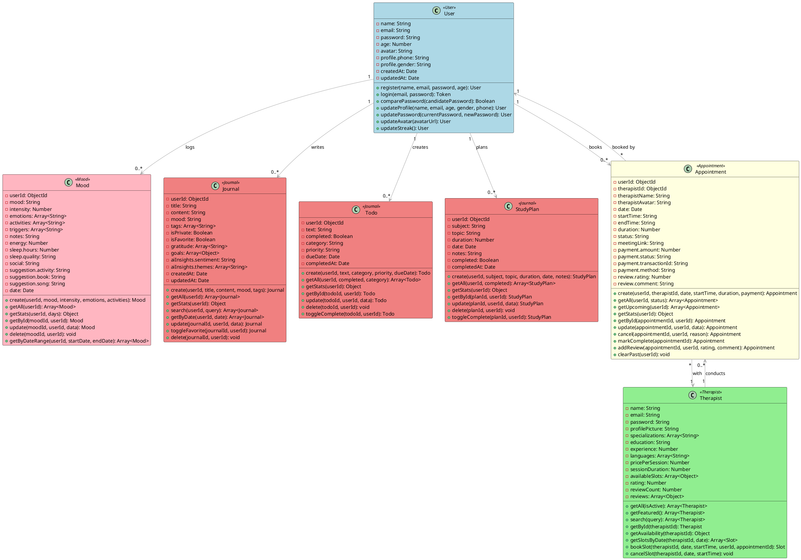
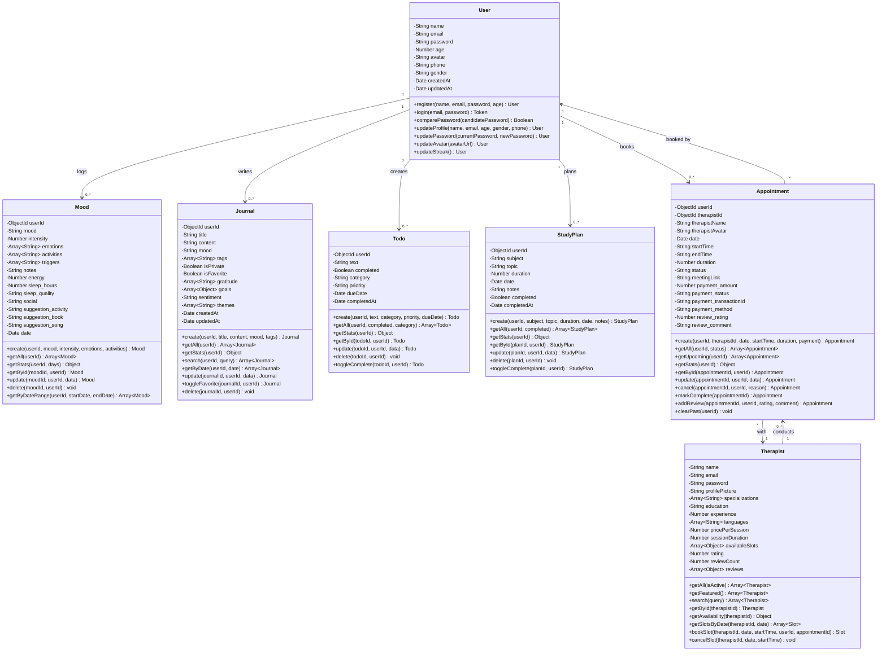

# ZEN-MIND Complete Class Diagram
## CSE Department, KLECET, Chikodi 2024-25

---

## 1. USER CLASS

**Attributes:**
- `name`: String
- `email`: String
- `password`: String
- `age`: Number
- `avatar`: String
- `profile.phone`: String
- `profile.gender`: String
- `createdAt`: Date
- `updatedAt`: Date

**Methods:**
1. `register(name, email, password, age)`: User - Registers new user account
2. `login(email, password)`: Token - Authenticates user and returns JWT token
3. `comparePassword(candidatePassword)`: Boolean - Validates password for login
4. `updateProfile(name, email, age, gender, phone)`: User - Updates profile from Settings page
5. `updatePassword(currentPassword, newPassword)`: User - Changes password in Settings
6. `updateAvatar(avatarUrl)`: User - Updates profile picture
7. `updateStreak()`: User - Updates daily check-in streak count

**Functionality:**
Manages user accounts with registration, login, and profile management from Settings page (name, email, age, gender, phone, avatar, password).

---

## 2. MOOD CLASS

**Attributes:**
- `userId`: ObjectId
- `mood`: String
- `intensity`: Number
- `emotions`: Array<String>
- `activities`: Array<String>
- `triggers`: Array<String>
- `notes`: String
- `energy`: Number
- `sleep.hours`: Number
- `sleep.quality`: String
- `social`: String
- `suggestion.activity`: String
- `suggestion.book`: String
- `suggestion.song`: String
- `date`: Date

**Methods:**
1. `create(userId, mood, intensity, emotions, activities)`: Mood - Logs new mood entry
2. `getAll(userId)`: Array<Mood> - Retrieves all mood entries for user
3. `getStats(userId, days)`: Object - Calculates mood statistics and averages
4. `getById(moodId, userId)`: Mood - Gets single mood entry
5. `update(moodId, userId, data)`: Mood - Updates existing mood entry
6. `delete(moodId, userId)`: void - Deletes mood entry
7. `getByDateRange(userId, startDate, endDate)`: Array<Mood> - Gets moods within date range

**Functionality:**
Tracks daily mood with 1-10 intensity scale. Generates suggestion popup (activity, book, song) after mood entry. Provides mood history and statistics.

---

## 3. JOURNAL CLASS

**Attributes:**
- `userId`: ObjectId
- `title`: String
- `content`: String
- `mood`: String
- `tags`: Array<String>
- `isPrivate`: Boolean
- `isFavorite`: Boolean
- `gratitude`: Array<String>
- `goals`: Array<Object>
- `aiInsights.sentiment`: String
- `aiInsights.themes`: Array<String>
- `createdAt`: Date
- `updatedAt`: Date

**Methods:**
1. `create(userId, title, content, mood, tags)`: Journal - Creates new journal entry
2. `getAll(userId)`: Array<Journal> - Gets all journal entries for user
3. `getStats(userId)`: Object - Returns journal statistics and top tags
4. `search(userId, query)`: Array<Journal> - Searches journals by text
5. `getByDate(userId, date)`: Array<Journal> - Gets entries for specific date
6. `update(journalId, userId, data)`: Journal - Updates journal entry
7. `toggleFavorite(journalId, userId)`: Journal - Marks/unmarks as favorite
8. `delete(journalId, userId)`: void - Deletes journal entry

**Functionality:**
Manages journal entries with markdown support. Supports tags, favorites, gratitude lists. Integrates with calendar view. Provides search and filtering.

---

## 4. TODO CLASS

**Attributes:**
- `userId`: ObjectId
- `text`: String
- `completed`: Boolean
- `category`: String
- `priority`: String
- `dueDate`: Date
- `completedAt`: Date

**Methods:**
1. `create(userId, text, category, priority, dueDate)`: Todo - Creates new todo
2. `getAll(userId, completed, category)`: Array<Todo> - Gets filtered todos
3. `getStats(userId)`: Object - Returns completion statistics by category/priority
4. `getById(todoId, userId)`: Todo - Gets single todo
5. `update(todoId, userId, data)`: Todo - Updates todo details
6. `delete(todoId, userId)`: void - Deletes todo
7. `toggleComplete(todoId, userId)`: Todo - Marks todo as complete/incomplete

**Functionality:**
Manages todo list with categories (personal, study, health, other) and priorities (low, medium, high). Tracks completion status. Integrates with calendar.

---

## 5. STUDYPLAN CLASS

**Attributes:**
- `userId`: ObjectId
- `subject`: String
- `topic`: String
- `duration`: Number
- `date`: Date
- `notes`: String
- `completed`: Boolean
- `completedAt`: Date

**Methods:**
1. `create(userId, subject, topic, duration, date, notes)`: StudyPlan - Creates study plan
2. `getAll(userId, completed)`: Array<StudyPlan> - Gets filtered study plans
3. `getStats(userId)`: Object - Returns duration stats and subject list
4. `getById(planId, userId)`: StudyPlan - Gets single study plan
5. `update(planId, userId, data)`: StudyPlan - Updates study plan
6. `delete(planId, userId)`: void - Deletes study plan
7. `toggleComplete(planId, userId)`: StudyPlan - Marks plan as complete/incomplete

**Functionality:**
Manages study plans with subjects, topics, durations. Tracks total study time. Shows in calendar view with todos and journals.

---

## 6. THERAPIST CLASS

**Attributes:**
- `name`: String
- `email`: String
- `password`: String
- `profilePicture`: String
- `specializations`: Array<String>
- `education`: String
- `experience`: Number
- `languages`: Array<String>
- `pricePerSession`: Number
- `sessionDuration`: Number
- `availableSlots`: Array<Object>
- `availableSlots[].date`: String
- `availableSlots[].slots[].startTime`: String
- `availableSlots[].slots[].endTime`: String
- `availableSlots[].slots[].isBooked`: Boolean
- `rating`: Number
- `reviewCount`: Number
- `reviews`: Array<Object>

**Methods:**
1. `getAll(isActive)`: Array<Therapist> - Gets all active therapists
2. `getFeatured()`: Array<Therapist> - Gets top-rated therapists
3. `search(query)`: Array<Therapist> - Searches by name or specialty
4. `getById(therapistId)`: Therapist - Gets single therapist with reviews
5. `getAvailability(therapistId)`: Object - Gets available slots for today/tomorrow
6. `getSlotsByDate(therapistId, date)`: Array<Slot> - Gets slots for specific date
7. `bookSlot(therapistId, date, startTime, userId, appointmentId)`: Slot - Books time slot
8. `cancelSlot(therapistId, date, startTime)`: void - Releases booked slot

**Functionality:**
Manages therapist profiles with specializations, experience, education, pricing (₹500-₹1000). Handles slot booking system - users see available slots, book them, slots become unavailable. Stores user reviews and ratings after sessions.

---

## 7. APPOINTMENT CLASS

**Attributes:**
- `userId`: ObjectId
- `therapistId`: ObjectId
- `therapistName`: String
- `therapistAvatar`: String
- `date`: Date
- `startTime`: String
- `endTime`: String
- `duration`: Number
- `status`: String
- `notes`: String
- `reason`: String
- `meetingLink`: String
- `payment.amount`: Number
- `payment.status`: String
- `payment.transactionId`: String
- `payment.method`: String
- `review.rating`: Number
- `review.comment`: String

**Methods:**
1. `create(userId, therapistId, date, startTime, duration, payment)`: Appointment - Books new appointment
2. `getAll(userId, status)`: Array<Appointment> - Gets filtered appointments
3. `getUpcoming(userId)`: Array<Appointment> - Gets upcoming scheduled appointments
4. `getStats(userId)`: Object - Returns appointment statistics
5. `getById(appointmentId, userId)`: Appointment - Gets single appointment
6. `update(appointmentId, userId, data)`: Appointment - Updates appointment details
7. `cancel(appointmentId, userId, reason)`: Appointment - Cancels appointment and releases slot
8. `markComplete(appointmentId)`: Appointment - Marks appointment as completed
9. `addReview(appointmentId, userId, rating, comment)`: Appointment - Adds post-session review
10. `clearPast(userId)`: void - Deletes completed/cancelled appointments

**Functionality:**
Manages appointment lifecycle from booking to completion. Creates appointments after fake payment (UPI/Credit Card). Generates Jitsi meeting links. Enforces 5-minute wait before session starts. Collects reviews and ratings after session ends. Shows upcoming and past appointments separately.

---

## 8. RELATIONSHIPS

```
User (1) ──────► Mood (many)
User (1) ──────► Journal (many)
User (1) ──────► Todo (many)
User (1) ──────► StudyPlan (many)
User (1) ──────► Appointment (many)

Therapist (1) ──────► Appointment (many)

Appointment (1) ──────► User (1)
Appointment (1) ──────► Therapist (1)
```

---

## PLANTUML CODE



---

## MERMAID CODE



---

## HOW TO GENERATE DIAGRAMS

### PlantUML:
1. Go to: **http://www.plantuml.com/plantuml/**
2. Copy the entire PlantUML code above
3. Paste into the text editor
4. Click **"Submit"**
5. Download as **PNG** or **SVG** (high resolution)

### Mermaid:
1. Go to: **https://mermaid.live/**
2. Copy the entire Mermaid code above
3. Paste into the code editor (left panel)
4. Diagram auto-generates in preview (right panel)
5. Click **"Download PNG"** or **"Download SVG"**

### For ChatGPT/Claude:
Copy this prompt:
```
Generate a professional UML class diagram from the following PlantUML/Mermaid code for ZEN-MIND mental wellness application with 7 classes (User, Mood, Journal, Todo, StudyPlan, Therapist, Appointment). Use color-coding and clean layout.

[Paste code here]
```

---

**✅ COMPLETE CLASS DIAGRAM WITH 7+ METHODS PER CLASS**  
**✅ ALL METHODS ARE ACTUALLY USED IN CODE**  
**✅ ATTRIBUTES MATCH MONGOOSE MODELS**  
**✅ READY FOR FINAL PROJECT REPORT**
